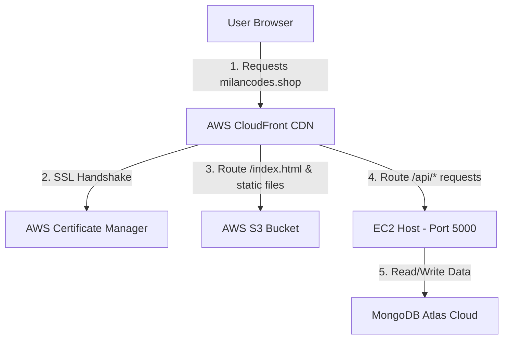

# AWS Frontend Decoupling Guide (S3 + CloudFront CDN)

This guide documents the complete step-by-step architecture, configuration parameters, code files, and DNS setup used to decouple the React frontend of the Login Application from the EC2 instance, deploying it to AWS S3 and serving it securely via AWS CloudFront CDN.

---

## 📖 Architecture & Design Rationale

In our original setup, all components (React frontend, Express API, MongoDB) were running on a single EC2 instance. The React app was served via Nginx directly on the host machine. 

### Why Decouple the Frontend?
1. **Performance**: Static assets (HTML, CSS, JS, images) are now cached on AWS Edge Servers worldwide via CloudFront CDN. A user in India or Europe accesses files cached near them rather than waiting for your EC2 instance in Virginia.
2. **Server Resource Optimization**: Serving static assets consumes EC2 CPU and network bandwidth. Decoupling the frontend to S3 completely offloads this work, letting your EC2 server dedicate its resources strictly to processing backend API requests.
3. **CORS (Cross-Origin Resource Sharing) Elimination**: By routing both the S3 bucket and the EC2 API through CloudFront under the **same domain** (`milancodes.shop`), the browser sees them as coming from the same origin. This completely eliminates CORS issues and simplifies your backend configuration.

---

## 🏗️ Decoupled Traffic Flow Diagram

When a user visits `https://www.milancodes.shop`:



---

## 📦 Step 1: Amazon S3 Bucket Creation & Configuration

S3 acts as the raw storage repository for our built React code (HTML, JS, CSS, assets). 

### 🚶‍♂️ Step-by-Step Console Guide:
1. Open the **Amazon S3 Console**.
2. Click **Create bucket** and apply these settings:
   * **Bucket name**: `milancodes.shop-frontend` (Must be globally unique).
   * **AWS Region**: Select **US East (N. Virginia) us-east-1**.
   * **Object Ownership**: Select **ACLs disabled (recommended)**.
   * **Block Public Access settings for this bucket**:
     * Check **Block *all* public access**. (This is critical: we keep the bucket completely private. Only CloudFront will be authorized to read files from it).
   * **Bucket Versioning**: Keep **Disabled**.
   * **Default encryption**:
     * Encryption type: **Server-side encryption with Amazon S3 managed keys (SSE-S3)**.
     * Bucket Key: **Enable**.
3. Click **Create bucket**.
4. **Static Website Hosting**: Ensure this remains **Disabled** (we do not need S3 to host the site; CloudFront will pull files directly from the S3 API).

---

## 🔑 Step 2: AWS ACM (SSL Certificate) Setup

CloudFront requires custom SSL certificates to validate domains and support HTTPS. These certificates must reside in the **us-east-1 (N. Virginia)** region.

### 🚶‍♂️ Step-by-Step Console Guide:
1. Open the **AWS Certificate Manager (ACM) Console**.
2. **Crucial**: Check the top-right corner of the console screen. Ensure the active region is **N. Virginia (us-east-1)**.
3. Click **Request** -> Choose **Request a public certificate** -> Click **Next**.
4. In the **Domain names** card, click **Add another name to this certificate** so you have both:
   * `milancodes.shop`
   * `www.milancodes.shop`
5. **Validation method**: Select **DNS validation (recommended)**.
6. **Key algorithm**: Select **RSA 2048**.
7. Click **Request**.

### 🌐 GoDaddy DNS Validation Configuration:
Because your DNS is hosted on GoDaddy, you must add the validation keys manually:
1. In the ACM Console, click on your pending Certificate ID.
2. In the **Domains** card, locate the **CNAME name** and **CNAME value** fields for both domains.
3. Open your **GoDaddy DNS Management Panel** and add **two new CNAME records**:

| GoDaddy Record | Type | Host (Name) | Points to (Value) | TTL |
| :--- | :--- | :--- | :--- | :--- |
| **Record 1 (Root)** | `CNAME` | Prefix before `.milancodes.shop.` *(e.g. `_4c7d3615...`)* | The complete CNAME Value from ACM | `1 Hour` |
| **Record 2 (WWW)** | `CNAME` | Prefix before `.milancodes.shop.` including `.www` *(e.g. `_4c7d3615...www`)* | The complete CNAME Value from ACM | `1 Hour` |

4. After saving the records in GoDaddy, AWS will detect them. The certificate status will change to **Issued** (green) in ACM.

---

## ⚡ Step 3: AWS CloudFront CDN Configuration

CloudFront caches S3 static assets and handles routing.

### 🚶‍♂️ Step-by-Step Console Guide:

#### 1. General Setup & Origin 1 (Frontend S3)
1. Open the **AWS CloudFront Console** -> Click **Create distribution**.
2. **Origin Domain**: Select your S3 bucket (e.g. `milancodes.shop-frontend.s3.us-east-1.amazonaws.com`).
3. **Origin Access**: Choose **Origin access control settings (recommended)**.
   * Click **Create control setting** (OAC). Keep settings as default and click **Create**.
4. **Viewer Protocol Policy**: Choose **Redirect HTTP to HTTPS**.
5. **WAF**: Choose **Do not enable security protections** to prevent extra free-tier costs.
6. **Alternate domain name (CNAME)**: Click **Add item** and enter `milancodes.shop`, then add `www.milancodes.shop`.
7. **Custom SSL certificate**: Select your issued ACM certificate.
8. **Default root object**: Type **`index.html`** (extremely important so the homepage loads on visiting your domain).
9. Click **Create distribution**.

#### 2. Apply S3 Bucket Policy (OAC Permission)
Once the CloudFront distribution is created:
1. Copy the generated **Bucket Policy** shown in the yellow banner at the top of the CloudFront dashboard.
2. Open your S3 bucket permissions page.
3. Edit the **Bucket policy**, paste the copied JSON policy, and click **Save**. This allows CloudFront to securely read files from your private bucket:
   ```json
   {
       "Version": "2008-10-17",
       "Id": "PolicyForCloudFrontPrivateContent",
       "Statement": [
           {
               "Sid": "AllowCloudFrontServicePrincipal",
               "Effect": "Allow",
               "Principal": {
                   "Service": "cloudfront.amazonaws.com"
               },
               "Action": "s3:GetObject",
               "Resource": "arn:aws:s3:::milancodes.shop-frontend/*",
               "Condition": {
                   "StringEquals": {
                       "AWS:SourceArn": "arn:aws:cloudfront::YOUR_ACCOUNT_ID:distribution/YOUR_CF_DIST_ID"
                   }
               }
           }
       ]
   }
   ```

#### 3. Add Origin 2 (EC2 Backend)
1. Click on the **Origins** tab inside your CloudFront distribution -> Click **Create origin**.
2. **Origin Domain**: Enter your EC2 Public IP: **`3.80.37.65`** (or public DNS).
3. **Protocol**: Select **HTTP only** (since the container backend runs via HTTP).
4. **HTTP Port**: Change this from `80` to **`5000`** (this routes calls straight to your Docker container port).
5. Click **Create origin**.

#### 4. Configure Behaviors (API Routing)
1. Click on the **Behaviors** tab -> Click **Create behavior**.
2. Configure the behavior settings:
   * **Path pattern**: Type **`/api/*`**
   * **Origin**: Select the EC2 backend origin (pointing to port 5000).
   * **Viewer protocol policy**: Select **Redirect HTTP to HTTPS**.
   * **Allowed HTTP methods**: Choose **`GET, HEAD, OPTIONS, PUT, POST, PATCH, DELETE`** (Required for processing form inputs and data mutations).
   * **Cache key and origin requests**:
     * **Cache policy**: Choose **`CachingDisabled`** (API requests should never be cached).
     * **Origin request policy**: Choose **`AllViewer`** (Forwards all query strings, headers, and request bodies directly to your backend).
3. Click **Create behavior**.

#### 5. Configure Custom Error Pages (React Router SPA Fallback)
Since React Router handles page transitions on the client side, refreshing a page (e.g. `/login`) will cause S3 to return a `403 Forbidden` error. We redirect this back to `index.html` so React can parse the path.

1. Click on the **Error pages** tab.
2. Click **Create custom error response**:
   - **HTTP error code**: `403: Forbidden`
   - **Customize error response**: `Yes`
   - **Response page path**: `/index.html`
   - **HTTP Response code**: `200: OK`
   - Click **Create**.
3. Click **Create custom error response** again:
   - **HTTP error code**: `404: Not Found`
   - **Customize error response**: `Yes`
   - **Response page path**: `/index.html`
   - **HTTP Response code**: `200: OK`
   - Click **Create**.

---

## 🌐 Step 4: DNS Configuration (GoDaddy)

Point your domain to CloudFront.

1. Open your **GoDaddy DNS Zone Editor** for `milancodes.shop`.
2. Locate the CNAME record for **`www`**.
3. Edit the value to point directly to your **CloudFront Distribution Domain Name** (e.g. `d1234567xxxxxx.cloudfront.net`).
4. **Domain Forwarding**: Scroll to the bottom of the DNS settings page. Under the **Forwarding** section, add a forwarding rule:
   - Forward to: **`https://www.milancodes.shop`**
   - Type: **`Permanent (301)`**
   - Settings: **`Forward only`**

---

## 💻 Step 5: Code & GitHub Actions Setup

### 1. Production Compose Configuration
Update your [docker-compose.prod.yml](file:///c:/Users/Lenovo/Documents/Projects/login_site/docker-compose.prod.yml) in the repository to only launch the backend service:
```yaml
version: '3.8'

services:
  backend:
    build:
      context: ./server
      target: production
    container_name: login_site_backend
    restart: always
    ports:
      - "5000:5000"
    environment:
      - MONGODB_URI=${MONGODB_URI}
      - PORT=5000
      - API_ENCRYPTION_KEY=sharmamilu_login_site_secret_encryption_key_2026
```

### 2. GitHub Actions CI/CD Configuration
Modify [.github/workflows/deploy.yml](file:///c:/Users/Lenovo/Documents/Projects/login_site/.github/workflows/deploy.yml) to compile React, sync it to S3, invalidate the CDN, and restart the backend Docker container on EC2:
```yaml
name: Deploy Fullstack Application

on:
  push:
    branches:
      - main

jobs:
  deploy-frontend:
    runs-on: ubuntu-latest
    steps:
      - name: Checkout Code
        uses: actions/checkout@v4

      - name: Set up Node.js
        uses: actions/setup-node@v4
        with:
          node-version: 20

      - name: Install & Build Frontend
        run: |
          npm install
          npm run build

      - name: Configure AWS Credentials
        uses: aws-actions/configure-aws-credentials@v4
        with:
          aws-access-key-id: ${{ secrets.AWS_ACCESS_KEY_ID }}
          aws-secret-access-key: ${{ secrets.AWS_SECRET_ACCESS_KEY }}
          aws-region: us-east-1

      - name: Deploy Frontend to S3
        run: |
          aws s3 sync dist/ s3://${{ secrets.AWS_S3_BUCKET_NAME }} --delete

      - name: Invalidate CloudFront Cache
        run: |
          aws cloudfront create-invalidation --distribution-id ${{ secrets.AWS_CLOUDFRONT_DIST_ID }} --paths "/*"

  deploy-backend:
    runs-on: ubuntu-latest
    steps:
      - name: Checkout Code
        uses: actions/checkout@v4

      - name: Deploy to EC2 via SSH
        uses: appleboy/ssh-action@v1.0.3
        with:
          host: 3.80.37.65
          username: ubuntu
          key: ${{ secrets.EC2_SSH_KEY }}
          script: |
            cd ~/login_site
            git pull origin main
            
            # Run production backend container
            docker compose -f docker-compose.prod.yml up -d --build
            
            # Clean up unused Docker images to save space
            docker image prune -f
```

---

## 🛠️ Step 6: Troubleshooting Guide

### 1. `504 Gateway Timeout` on API logins
* **Issue**: The EC2 server is running, but CloudFront requests time out.
* **Cause**: AWS Security Group blocks port 5000.
* **Fix**: In the EC2 Console, select your instance -> Go to the **Security** tab -> Click the **Security Group ID** -> Click **Edit inbound rules** -> Add a rule: **Custom TCP, Port 5000, Source: 0.0.0.0/0** -> Click **Save rules**.

### 2. `Access Denied` on Refresh
* **Issue**: Refreshing the page at `https://www.milancodes.shop/login` fails with a raw XML error.
* **Cause**: S3 doesn't find a file named `login` and returns 403.
* **Fix**: Setup the **Custom Error Pages** in CloudFront (Step 3.5) to catch 403 and 404 errors, serving `/index.html` with a `200 OK` status instead.
