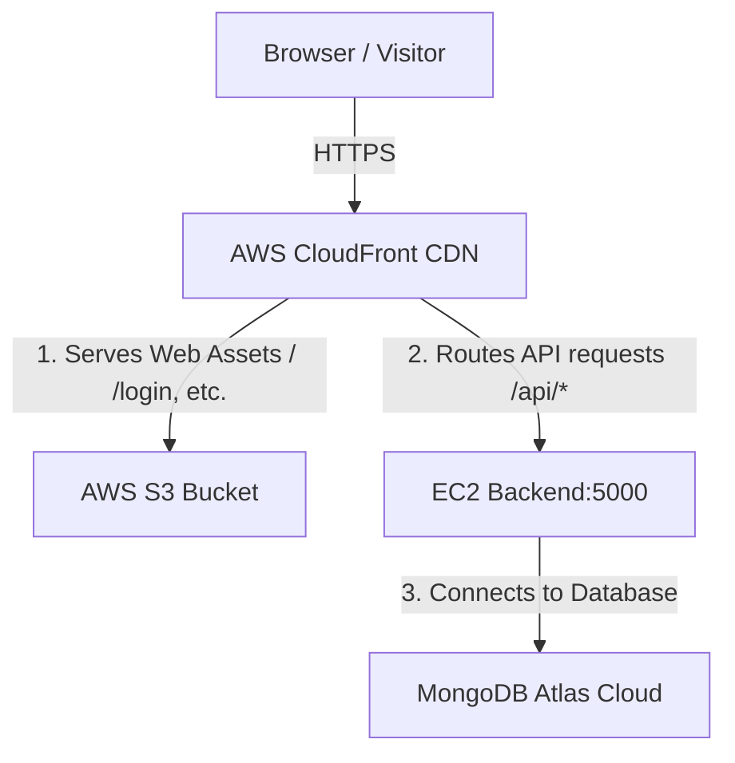

# AWS Frontend Decoupling Guide (S3 + CloudFront CDN)

This guide documents the complete step-by-step procedure implemented to decouple the React frontend from the EC2 instance and host it on AWS S3 and CloudFront.

---

## 🏗️ Architecture Overview

By moving the React static assets to S3 and using CloudFront as an edge router, we decoupled our Compute layer (EC2) from our Presentation layer (S3). 

---

## 📦 Step 1: Amazon S3 Configuration (The Storage)

We created a single private S3 bucket to hold the compiled static React assets (the `dist/` folder content).

### Settings Used:
* **Bucket name**: `milancodes.shop-frontend` (Must be globally unique)
* **AWS Region**: `us-east-1` (US East - N. Virginia)
* **Object Ownership**: `ACLs disabled (recommended)`
* **Block Public Access**: **Enabled / Checked** (Keeps S3 private from the web; traffic is only permitted via CloudFront).
* **Static Website Hosting**: **Disabled** (Not required because CloudFront reads directly from S3 using the S3 API).

---

## 🔑 Step 2: AWS ACM Configuration (SSL Certificates)

CloudFront requires Custom SSL Certificates to be located in the **N. Virginia (`us-east-1`)** region.

### Steps Followed:
1. Switched AWS Console region to `us-east-1`.
2. Opened **Certificate Manager (ACM)** and requested a public certificate.
3. Added domains:
   - `milancodes.shop`
   - `www.milancodes.shop`
4. Selected **DNS Validation** as the verification method.

### 🌐 GoDaddy DNS Validation:
Since your domain name is registered with GoDaddy, validation was completed by adding the validation records manually:
1. In the GoDaddy DNS zone settings, added a new **CNAME** record.
2. **Host / Name**: Pasted the prefix *before* the domain name. 
   - *Example: If ACM provided `_7a25.milancodes.shop.`, enter only **`_7a25`** (for root) or **`_7a25.www`** (for www).*
3. **Value / Points to**: Pasted the full CNAME value provided by ACM.
4. Once GoDaddy DNS propagated, ACM automatically verified ownership and changed the status to **Issued**.

---

## ⚡ Step 3: AWS CloudFront CDN (Routing & Edge Caching)

CloudFront is the central manager that links S3, ACM, and EC2 together under your custom domain name.

### 1. Origins Set Up:
* **Origin 1 (Frontend)**: Pointed to the S3 bucket `milancodes.shop-frontend.s3.us-east-1.amazonaws.com`.
  - **Origin Access**: Configured **Origin Access Control (OAC)** to generate a secure policy.
* **Origin 2 (Backend)**: Pointed to the EC2 Public DNS or IP: `3.80.37.65` on port **`5000`** via **HTTP only** (re-routing API calls directly to the docker container).

### 2. Behaviors (Routing Rules):
* **Default Behavior (`*`)**: 
  - Routes traffic to the S3 Origin.
  - Viewer Protocol Policy: `Redirect HTTP to HTTPS`.
  - Cache Policy: `CachingOptimized`.
* **API Behavior (`/api/*`)**:
  - Routes traffic to the EC2 Origin on port 5000.
  - Viewer Protocol Policy: `Redirect HTTP to HTTPS`.
  - Allowed HTTP Methods: `GET, HEAD, OPTIONS, PUT, POST, PATCH, DELETE`.
  - Cache Policy: `CachingDisabled` (Ensures database requests are never cached).
  - Origin Request Policy: `AllViewer` (Forwards all query parameters, headers, and request bodies).

### 3. General Settings:
* **Alternate Domain Names (CNAMEs)**: `milancodes.shop` and `www.milancodes.shop`.
* **SSL Certificate**: Selected the `milancodes.shop` ACM certificate.
* **Default Root Object**: `index.html` (Serves the homepage automatically).

---

## 🛡️ Step 4: DNS Mapping & Root Forwarding (GoDaddy)

Because GoDaddy does not support CNAME records at the root domain (`milancodes.shop`), we routed traffic using CNAME mapping and forwarding:

1. **`www` mapping**: Updated the `www` CNAME record in GoDaddy to point to the CloudFront distribution domain name: `d1234567xxxxxx.cloudfront.net`.
2. **Root Forwarding**: Configured **Domain Forwarding** in the GoDaddy dashboard to permanently redirect `http://milancodes.shop` and `https://milancodes.shop` to `https://www.milancodes.shop`.

---

## 🤖 Step 5: Code & CI/CD Pipeline Automation

With the frontend served by CDN, we adjusted the repository configuration to run the deployment.

### 1. Docker Production Compose
Updated [docker-compose.prod.yml](file:///c:/Users/Lenovo/Documents/Projects/login_site/docker-compose.prod.yml) to remove the `frontend` service. The EC2 server now **only** runs the backend Express API container.

### 2. GitHub Actions Deployment
Rewrote [.github/workflows/deploy.yml](file:///c:/Users/Lenovo/Documents/Projects/login_site/.github/workflows/deploy.yml) to split into two jobs:
* **`deploy-frontend`**: Builds the React static files, logs into AWS, uploads files to S3 (`aws s3 sync`), and invalidates CloudFront cache (`aws cloudfront create-invalidation`) so updates are instant.
* **`deploy-backend`**: SSHs into EC2, pulls code, and runs `docker compose` to restart the backend container.

#### Required GitHub Secrets:
* `AWS_ACCESS_KEY_ID`: Generated in AWS IAM.
* `AWS_SECRET_ACCESS_KEY`: Generated in AWS IAM.
* `AWS_S3_BUCKET_NAME`: `milancodes.shop-frontend`.
* `AWS_CLOUDFRONT_DIST_ID`: Your CloudFront distribution ID.
* `EC2_SSH_KEY`: SSH private key for your EC2 server.

---

## 🛠️ Step 6: Troubleshooting & Common Gotchas

### 1. `504 Gateway Timeout` on API requests
* **Reason**: Your EC2 instance has an AWS Security Group blocking port `5000`. Because CloudFront sends `/api/*` requests directly to port 5000, it cannot connect.
* **Fix**: In the EC2 security group settings, edit the inbound rules and add a rule allowing **Custom TCP, Port 5000, Source: 0.0.0.0/0**.

### 2. `Access Denied` on refreshing React pages (e.g. `/login`)
* **Reason**: Single Page Applications handle routing in the browser. When you refresh `/login`, S3 looks for a folder named `login` in the bucket, fails to find it, and returns a 403 error.
* **Fix**: Configure CloudFront **Custom Error Pages**:
  - Add error response for **403: Forbidden** -> Customize: Yes -> Path: `/index.html` -> Status: `200 OK`.
  - Add error response for **404: Not Found** -> Customize: Yes -> Path: `/index.html` -> Status: `200 OK`.
